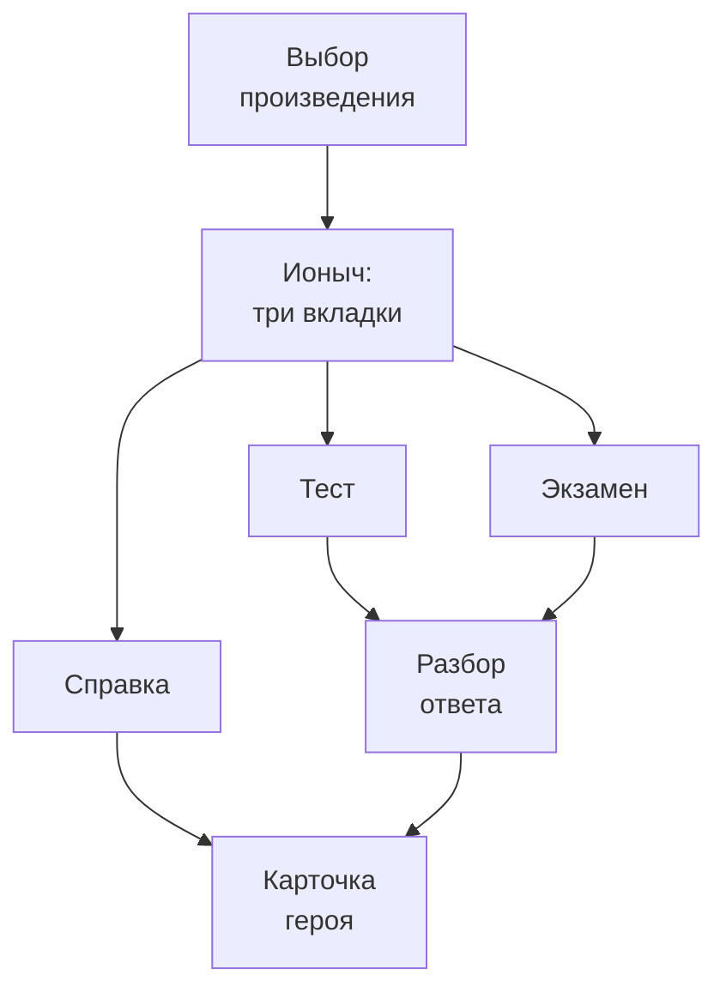

# «Сюжетная дыра»: структура приложения

Источник: три документа пользователя по «Ионычу» (литературная справка, тест на один
верный вариант, задания на сопоставление). Внешние источники не использовались.

Три свободные вкладки — справка, тест, экзамен — поверх одного произведения. Макет
строится от телефона: всё, что есть на десктопе, должно помещаться в экран 360 px без
горизонтальной прокрутки.

## Карта экранов

Всего шесть экранов. Три вкладки лежат на одном уровне и переключаются свободно, без
блокировок.

Разбор ответа — общий экран для теста и экзамена, и именно он возвращает ученика в
справку. Без этой стрелки три вкладки распадаются на три несвязанных приложения.

Карточка героя — не отдельная страница, а шторка поверх текущего экрана. Ученик
закрывает её и остаётся там, откуда пришёл.

## Адаптив

| Брейкпоинт | Ширина | Сетка | Главное отличие |
| --- | --- | --- | --- |
| Телефон | 360–767 px | 1 колонка, поля 16 px | Навигация внизу, карточка героя — шторка снизу |
| Планшет | 768–1279 px | 2 колонки, поля 32 px | Герои в два ряда, навигация переезжает наверх |
| Десктоп | от 1280 px | Контент до 960 px, по центру | Карточка героя — боковая панель справа, задание остаётся видно |

Два правила важнее самих брейкпоинтов:

1. Цитата никогда не обрезается многоточием и не прячется под «показать ещё». Самая
   длинная цитата (про бумажки в карманах) — около 400 знаков, на 360 px это порядка
   девяти строк, и они должны помещаться целиком.
2. Зона ответа всегда досягаема большим пальцем. На телефоне варианты ответа прижаты к
   нижней трети экрана, высота кнопки не меньше 48 px, вопрос уезжает наверх.

## Экран 1. Выбор произведения

Пока произведение одно, этот экран — не витрина каталога, а точка входа в «Ионыча».

- Название произведения и автор крупно
- Четыре метки справки: эпос, рассказ, реализм, 1898 год
- Шесть героев и число цитат в базе
- Три кнопки по числу вкладок, с прогрессом на каждой
- Строка «Не читали рассказ? Начните со справки» — подсказка вместо блокировки

Когда произведений станет несколько, экран превращается в список карточек, а блок
«Ионыча» уезжает наверх как «продолжить». Платные произведения видны сразу и выглядят
как обычные карточки с меткой, а не как замки поверх размытого содержимого.

## Вкладка 1. Справка

### 1.1 Шапка произведения

Автор, род, жанр, направление — четыре плашки в ряд. Ровно эти четыре факта спрашивают
в разминке на вкладке «Экзамен».

### 1.2 Герои

Шесть карточек. На телефоне — список в одну колонку, на планшете и десктопе — сетка.

| Герой | Роль | Глубина материала |
| --- | --- | --- |
| Дмитрий Старцев (Ионыч) | Главный | Полный набор полей, два состояния: в начале и в финале |
| Екатерина Ивановна (Котик) | Главная | Полный набор, два состояния: до консерватории и после возвращения |
| Иван Петрович Туркин | Отец | Полный набор, одно состояние — он не меняется |
| Вера Иосифовна Туркина | Мать | Полный набор, одно состояние |
| Лакей Пава | Второстепенный | Короткая карточка: одна реплика и её смысл |
| Кучер Пантелеймон | Второстепенный | Короткая карточка: зеркало Старцева |

Внутри карточки героя — один и тот же набор полей для всех: внешность, деятельность,
увлечение, материальное положение, характер, отношение к другим, финал. Поле без
подтверждённой цитаты не показывается вовсе — никаких прочерков и «не указано».

У Старцева и Котика карточка работает переключателем «в начале / в финале».

### 1.3 Любовная линия

Шесть шагов вертикальной лентой: влюблённость — свидание на кладбище — мысли о
приданом — отказ — встреча через четыре года — равнодушие. Единственное место, где
материал устроен по времени, а не по героям. Каждый шаг кликабелен и ведёт к цитате.

### 1.4 Места

Три карточки: кладбище, городской сад, земская больница в Дялиже.

## Вкладка 2. Тест

Двадцать вопросов, три варианта, один верный.

### 2.1 Экран вопроса

Сверху вниз: счётчик «7 из 20» и полоса прогресса, текст вопроса, три варианта ответа.
Кнопки «дальше» нет: выбор варианта сразу засчитывает ответ.

| Тип | Пример | Как верстать |
| --- | --- | --- |
| Факт | «Где Котик назначает свидание?» | Короткие варианты в одну строку, кнопки рядом |
| Цитата | «Какой характер у Ивана Петровича?» — три цитаты на выбор | Вариант — целый абзац, карточки столбиком, большие отступы |

Второй тип важнее первого: именно он тренирует то, что нужно на экзамене. Вопрос в
этом случае прилипает к верху, чтобы не пропадать при прокрутке.

### 2.2 Разбор ответа

Появляется сразу после выбора, на том же экране. Четыре элемента всегда в одном порядке:

1. Верно или нет — цветом и словом, не только цветом
2. Верный вариант, если ошибся
3. Одна строка — почему именно он, со ссылкой на главу или эпизод
4. Кнопка «Посмотреть героя в справке» — открывает шторку, тест не теряется

Третий пункт — то, чего в исходном файле нет: там указан номер ответа, но не
объяснение. Без него тест проверяет, но не учит.

### 2.3 Итог

Счёт, список ошибок сгруппированный по героям, две кнопки — пройти заново или только
ошибки. Группировка по героям важнее самого счёта.

## Вкладка 3. Экзамен

### 3.1 Разминка

Три вопроса на короткий ответ: род, жанр, направление. Ответ вводится с клавиатуры, не
выбирается из вариантов. Проверка не придирается к регистру и окончаниям. Разминку
можно пропустить одной кнопкой.

### 3.2 Сопоставление

Три позиции слева (А, Б, В), четыре варианта справа, один лишний и выдуманный. Ответ —
трёхзначное число вроде 312.

| Устройство | Как работает |
| --- | --- |
| Телефон | Позиции А, Б, В стопкой сверху. Тап по позиции — выбор варианта из списка ниже. Никакого перетаскивания |
| Планшет и десктоп | Два столбца рядом, как в бумажном варианте. Перетаскивание допустимо, но дублируется кликом |

### 3.3 Шесть типов сопоставления

| Тип | Что сопоставляется |
| --- | --- |
| Характеристика | Герой → черта или род деятельности |
| Реплика | Герой → его слова |
| Предметная деталь | Герой → вещь или внешность |
| Судьба | Герой → что с ним стало |
| Место | Место → что там произошло |
| Отношение к деньгам | Герой или группа → поведение |

Два последних типа ломают схему «герой → цитата»: слева может стоять место, целая
семья или пациенты Старцева. Значит, в базе левая часть — не «герой», а «сущность»:
герой, группа или место.

### 3.4 Разбор после сопоставления

Разбирается не только верный ответ, но и лишний вариант — почему он правдоподобен и
чем выдаёт себя. Этот разбор и есть навык задания №2.

## Сквозные элементы

**Шапка.** Название произведения и кнопка назад. На телефоне прячется при прокрутке
вниз и возвращается при прокрутке вверх.

**Переключатель вкладок.** Три равные вкладки, всегда активны. На телефоне закреплён
внизу, на планшете и десктопе — под шапкой. На активной вкладке — точка прогресса, не
число.

**Прогресс.** У каждой вкладки свой счётчик: в справке — сколько героев открыто, в
тесте — лучший результат, в экзамене — сколько сопоставлений собрано без ошибок. В одну
общую цифру не складываются.

**Пустые состояния.** Три штуки, каждая с действием: тест ещё не пройден, ошибок нет
вовсе, герой ещё не открыт.

**Шторка героя.** Один компонент для всего приложения. Снизу на телефоне, справа на
десктопе. Всегда возвращает туда, откуда её открыли.

## Связки между вкладками

| Связка | Где стоит | Что делает |
| --- | --- | --- |
| Подсказка на входе | Экран выбора произведения | Одна строка: не читали — начните со справки |
| «Посмотреть в справке» | Каждый разбор ответа | Открывает шторку с нужным героем |
| Ошибки по героям | Экран итога | Счёт превращается в список героев для повторения |

## Компоненты для Figma

| Компонент | Состояния | Где используется |
| --- | --- | --- |
| Блок цитаты | Обычная, верная, неверная, лишняя | Везде — базовый кирпич |
| Поле карточки героя | С цитатой, без цитаты (скрыто) | Справка, шторка |
| Карточка героя в списке | Новый, в работе, выучен | Справка |
| Вариант ответа | Покой, нажат, верный, неверный, заблокирован | Тест |
| Строка сопоставления | Пустая, заполнена, верная, неверная | Экзамен |
| Блок разбора | Верно, неверно | Тест, экзамен |
| Полоса прогресса | Пустая, частичная, полная | Тест, экзамен |
| Навигация вкладок | Три активных состояния × два положения | Везде внутри произведения |
| Шторка героя | Снизу, справа | Везде |

Блок цитаты стоит первым не случайно: он появляется на каждом экране и всюду должен
выглядеть одинаково.

## Открытые вопросы

**В контенте.** В тесте у четырёх вопросов не указан правильный ответ: про реплику
Павы, про отношение Веры Иосифовны к образованию, про то, с кем сравнивается Старцев в
финале, и про финал рассказа. Название деревни написано двумя способами — Делиж и
Дялиж; сверить с текстом и выбрать одно.

**В механике.** По какому правилу герой считается выученным и когда возвращается на
повторение.

**В продукте.** Где проходит граница бесплатного. «Ионыч» бесплатен целиком — значит,
замков на этих экранах быть не должно.

**В формате задания №2.** Формулировка и структура задания менялись по годам. Прежде
чем жёстко закреплять формат в макетах, сверить с актуальной демоверсией ФИПИ.
Описанное выше опирается на формат из файлов пользователя, а не на проверенный источник.
